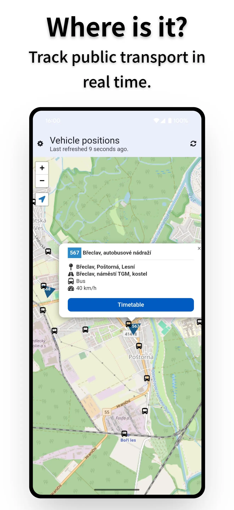

<h1 align="center">FindMyBus</h1>

    FindMyBus is an open-source Android application that allows you to view public transport vehicles positions on a map in real time.  
    Built with <a href="https://svelte.dev/">Svelte</a>, <a href="https://konstaui.com/">KonstaUI</a> and <a href="https://capacitorjs.com/">Capacitor</a>.

# Features
- Visualize GTFS Realtime feeds on a map
- See live positions of vehicles and extra information about them, such as their timetables
- Light data usage

## Installation
- Download and install an `.apk` file from the [Releases](https://github.com/TriLinder/FindMyBus/releases/latest) page
- Alternatively, you can build the app from source (see below)

# Screenshots

    
    
    

# Building
Prerequisites: Android Studio and Node.js (v22)

1. Clone the repository
2. Run `npm install` in the directory to install project dependencies
3. Run `npm run dev` to debug the application in a web browser
    - While running in a web browser, it might be necessary to temporarily [disable CORS protection](https://addons.mozilla.org/en-US/firefox/addon/cors-everywhere/) for the application to be able to reach your transport agency's GTFS feeds. **Please make sure to enable it again as soon as possible afterward.** As an alternative, download and host the GTFS files on a localhost webserver yourself.
    - During development, static GTFS data is stored in [localStorage](https://developer.mozilla.org/en-US/docs/Web/API/Window/localStorage). When testing with larger datasets, you might need to increase the [data quota](https://kb.mozillazine.org/Dom.storage.default_quota)
4. Run `npm run build && npx cap sync && npx cap open android` to build the web files and open the application in Android studio
5. Build the application in Android Studio